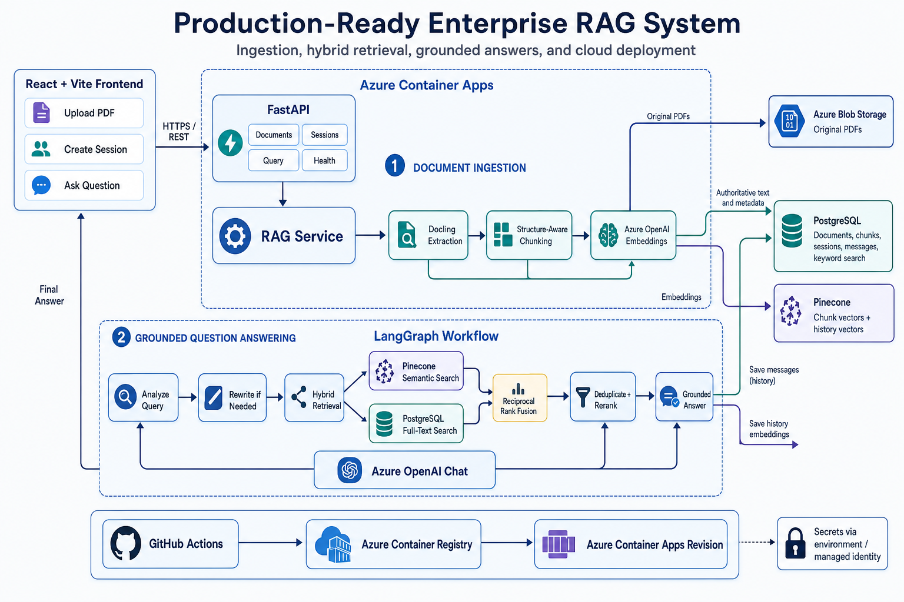

# Production-Ready Enterprise RAG System



## Project overview

This project is a Retrieval-Augmented Generation (RAG) application for asking questions about PDF documents.

Users can upload PDFs, create a chat session, and ask questions. The backend searches the uploaded documents and asks Azure OpenAI to create an answer grounded in the retrieved content. Each answer contains:

- A direct answer
- A short reason
- References to the source document and pages

The project contains a React frontend, a FastAPI backend, cloud storage, hybrid search, conversation history, and an automated Azure deployment workflow.

## How the architecture works

### 1. Document ingestion

1. The frontend uploads a PDF to the FastAPI backend.
2. Docling extracts text, headings, tables, images, and page information.
3. The extracted content is split into smaller chunks.
4. Azure OpenAI creates an embedding for every chunk.
5. The original PDF is stored in Azure Blob Storage.
6. PostgreSQL stores the document, chunk text, and metadata.
7. Pinecone stores the chunk embeddings for semantic search.

### 2. Question answering

1. The user creates a session and sends a question.
2. LangGraph checks whether the question has enough context.
3. If needed, the question is rewritten using recent session history.
4. Pinecone performs semantic search.
5. PostgreSQL performs keyword search.
6. The results are combined, duplicates are removed, and the best chunks are reranked.
7. Azure OpenAI creates a grounded answer from those chunks.
8. The answer, reason, references, and conversation history are returned to the frontend.

Use the same namespace when uploading documents and creating a session. For example, documents uploaded to `production` can be queried by sessions created with the `production` namespace.

## Technology and services

| Technology or service | Purpose |
|---|---|
| React and Vite | Provides the document upload and chat interface. |
| FastAPI | Exposes the backend REST API. |
| LangGraph | Runs the multi-step question-answering workflow. |
| Docling | Extracts structured content from PDF files. |
| Azure OpenAI embeddings | Converts document chunks and messages into vectors. |
| Azure OpenAI chat | Rewrites incomplete questions, reranks context, and generates answers. |
| Pinecone | Stores vectors and performs semantic search. It also stores conversation-history vectors in a separate namespace. |
| Azure Database for PostgreSQL | Stores documents, chunks, sessions, messages, and supports keyword search. |
| Azure Blob Storage | Stores the original uploaded PDF files. |
| Docker | Packages the backend and its runtime dependencies into one image. |
| Azure Container Registry | Stores versioned backend Docker images. |
| Azure Container Apps | Runs the backend image and creates a new revision for each deployment. |
| GitHub Actions | Builds the frontend, tests the backend, builds the Docker image, pushes it to the registry, and updates the Container App. |
| GitHub Secrets and Variables | Supplies deployment and runtime configuration without placing credentials in the repository. |

## Project structure

```text
Backend/
  database_setup/              PostgreSQL setup script
  rag_app/
    agents/                    LangGraph workflow and agents
    core/                      Settings, schemas, and exceptions
    database/                  PostgreSQL models and repositories
    document_extraction/       PDF extraction and chunking
    document_storage/          Azure Blob and local storage
    embedding_generation/      Azure OpenAI client
    rag_pipeline/              Ingestion and query orchestration
    retrieval/                 Hybrid search and result fusion
    routing/                   FastAPI routes only
    vector_store_operations/   Pinecone operations
  tests/                       Backend tests
Frontend/                      React and Vite frontend
.github/workflows/             CI and Azure deployment workflows
Dockerfile                     Production backend container
docker-compose.yml             Local PostgreSQL container
pyproject.toml                 Python dependencies
uv.lock                        Locked Python dependency versions
```

## Configuration

### Local backend configuration

Create a local environment file from the example:

```powershell
Copy-Item Backend/.env.example Backend/.env
```

Open `Backend/.env` and replace the example values. Do not commit this file.

The main settings are:

| Setting | Description |
|---|---|
| `AZURE_OPENAI_ENDPOINT` | Azure OpenAI resource endpoint. |
| `AZURE_OPENAI_API_KEY` | Azure OpenAI API key. |
| `AZURE_OPENAI_EMBEDDING_DEPLOYMENT` | Name of the deployed embedding model. |
| `AZURE_OPENAI_CHAT_DEPLOYMENT` | Name of the deployed chat model. |
| `EMBEDDING_DIMENSIONS` | Must match the dimension used by the Pinecone index. |
| `PINECONE_API_KEY` | Pinecone API key. |
| `PINECONE_HOST` | Host of the existing Pinecone index. |
| `PINECONE_NAMESPACE` | Default namespace for document vectors. |
| `POSTGRES_HOST` | PostgreSQL server hostname. |
| `POSTGRES_DATABASE` | Application database name. |
| `POSTGRES_USER` | Application database user. |
| `POSTGRES_PASSWORD` | Application database password. |
| `AZURE_STORAGE_ACCOUNT_URL` | Azure Blob Storage account URL. |
| `AZURE_STORAGE_CONTAINER` | Blob container used for PDFs. |
| `CORS_ALLOWED_ORIGINS` | Frontend addresses allowed to call the API. |

See `Backend/.env.example` for every available setting and its default value.

### GitHub secrets

Add these under **GitHub repository > Settings > Secrets and variables > Actions > Secrets**:

| Secret | Purpose |
|---|---|
| `AZURE_OPENAI_API_KEY` | Authenticates with Azure OpenAI. |
| `PINECONE_API_KEY` | Authenticates with Pinecone. |
| `POSTGRES_PASSWORD` | Password for the PostgreSQL application user. |
| `AZURE_STORAGE_CONNECTION_STRING` | Optional Blob credential. Use only one of the supported Blob credential secrets. |
| `AZURE_STORAGE_ACCOUNT_KEY` | Optional alternative Blob credential. |
| `AZURE_STORAGE_SAS_TOKEN` | Optional alternative Blob credential. |

Create the following secret in the GitHub environment named exactly **Production**:

| Environment secret | Purpose |
|---|---|
| `AZURE_CREDENTIALS` | Service-principal JSON used by GitHub Actions to sign in to Azure. |

If Blob Storage uses the Container App managed identity, no Blob credential secret is required. Give that identity the **Storage Blob Data Contributor** role on the storage account.

### GitHub variables

Add non-sensitive configuration under **GitHub repository > Settings > Secrets and variables > Actions > Variables**.

Required deployment variables:

| Variable | Description |
|---|---|
| `AZURE_CONTAINER_REGISTRY_NAME` | Registry name only, for example `backendrag`. |
| `AZURE_RESOURCE_GROUP` | Resource group containing the Container App. |
| `AZURE_CONTAINER_APP_NAME` | Existing Container App name. |
| `AZURE_OPENAI_ENDPOINT` | Azure OpenAI endpoint. |
| `AZURE_OPENAI_EMBEDDING_DEPLOYMENT` | Embedding deployment name. |
| `AZURE_OPENAI_CHAT_DEPLOYMENT` | Chat deployment name. |
| `PINECONE_HOST` | Pinecone index host. |
| `PINECONE_REGION` | Pinecone index region. |
| `POSTGRES_HOST` | PostgreSQL hostname. |
| `POSTGRES_DATABASE` | PostgreSQL database name. |
| `POSTGRES_USER` | PostgreSQL application user. |
| `AZURE_STORAGE_ACCOUNT_URL` | Blob Storage account URL. |
| `AZURE_STORAGE_CONTAINER` | Blob container name. |
| `CORS_ALLOWED_ORIGINS` | Allowed frontend origins, separated by commas. |

Common optional variables:

| Variable | Default |
|---|---|
| `CONTAINER_IMAGE_NAME` | `enterprise-rag-api` |
| `AZURE_OPENAI_API_VERSION` | `2024-10-21` |
| `EMBEDDING_DIMENSIONS` | `1536` |
| `PINECONE_INDEX_NAME` | `enterprise-rag` |
| `PINECONE_NAMESPACE` | `default` |
| `PINECONE_HISTORY_NAMESPACE` | `conversation-history` |
| `PINECONE_CLOUD` | `aws` |
| `PINECONE_METRIC` | `cosine` |
| `POSTGRES_PORT` | `5432` |
| `POSTGRES_SSLMODE` | `require` |
| `OBJECT_STORAGE_PROVIDER` | `azure_blob` |
| `AZURE_STORAGE_PREFIX` | `documents` |

Chunking, retrieval, reranking, history, and database pool settings are also optional. Their names and defaults are listed in `Backend/.env.example`.

Never store API keys, passwords, service-principal credentials, connection strings, account keys, or SAS tokens as GitHub variables.

## Run locally

### Requirements

- Python 3.12
- [uv](https://docs.astral.sh/uv/)
- Node.js and npm
- Docker Desktop, if PostgreSQL will run locally

### 1. Start PostgreSQL

```powershell
docker compose up -d postgres
```

For the local Docker database, use these values in `Backend/.env`:

```env
POSTGRES_HOST=localhost
POSTGRES_PORT=5432
POSTGRES_DATABASE=rag_db
POSTGRES_USER=rag_app
POSTGRES_PASSWORD=local-rag-password
POSTGRES_SSLMODE=disable
```

### 2. Start the backend

From the repository root:

```powershell
uv sync
uv run python -m Backend.rag_app.cli init-db
uv run uvicorn Backend.rag_app.api:app --reload
```

The backend is available at:

- API: `http://localhost:8000`
- Health check: `http://localhost:8000/health`
- Swagger UI: `http://localhost:8000/docs`

### 3. Start the frontend

Create `Frontend/.env`:

```env
VITE_API_BASE_URL=http://localhost:8000
```

Then run:

```powershell
cd Frontend
npm install
npm run dev
```

Open `http://localhost:5173`.

## Main API endpoints

| Method and endpoint | Purpose |
|---|---|
| `GET /health` | Checks whether the backend is running. |
| `POST /v1/documents?namespace=default` | Uploads and processes a PDF. |
| `POST /v1/sessions` | Creates a chat session with a name and namespace. |
| `GET /v1/sessions/{session_id}` | Returns the saved session history. |
| `POST /v1/query` | Answers a question using the session namespace and history. |
| `POST /v1/search/keyword` | Performs PostgreSQL keyword search directly. |

## Build and deploy with GitHub Actions

Two workflows are used:

1. **Backend CI** builds the frontend and runs the backend tests.
2. **Build, Push, and Deploy Backend** creates the Docker image, pushes it to Azure Container Registry, synchronizes the Container App settings, and deploys a new Container App revision.

Recommended deployment flow:

1. Push a feature branch.
2. Open a pull request into `main`.
3. Wait for **Backend CI** to pass.
4. Merge the pull request.
5. CI runs for `main`.
6. After CI succeeds, the deployment workflow runs automatically.

The deployment workflow can also be started manually from:

**GitHub > Actions > Build, Push, and Deploy Backend > Run workflow**

Manual deployment must use the `main` branch.

The workflow pushes two image tags:

```text
backendrag.azurecr.io/enterprise-rag-api:<git-commit-sha>
backendrag.azurecr.io/enterprise-rag-api:latest
```

The commit SHA tag is recommended for production because it points to one exact version of the code.

## Azure requirements

Before deploying, make sure:

- The Container App ingress target port is `8000`.
- External ingress is enabled if the browser calls the API directly.
- The Container App can pull images from Azure Container Registry.
- PostgreSQL allows network access from the Container Apps environment.
- The Pinecone index dimension matches `EMBEDDING_DIMENSIONS`.
- Blob Storage credentials or managed-identity permissions are configured.
- `CORS_ALLOWED_ORIGINS` contains the frontend URL.

The workflow sets `AUTO_INIT_DB=true`, so the backend creates missing application tables when a new revision starts. The database and application user must already exist and have permission to create tables in the application schema. The setup script is available at `Backend/database_setup/create_rag_database.sql`.

## Run the backend with Docker

```powershell
docker build -t enterprise-rag-api:local .
docker run --rm -p 8000:8000 --env-file Backend/.env `
  -e AUTO_INIT_DB=true enterprise-rag-api:local
```

Open `http://localhost:8000/docs` to test the API.

## Security notes

- Never commit `.env` files or credentials.
- Frontend variables are visible in the browser and must never contain secrets.
- Restrict PostgreSQL and storage network access for production.
- The current API does not include user authentication. Do not upload confidential documents until authentication and authorization are added.
